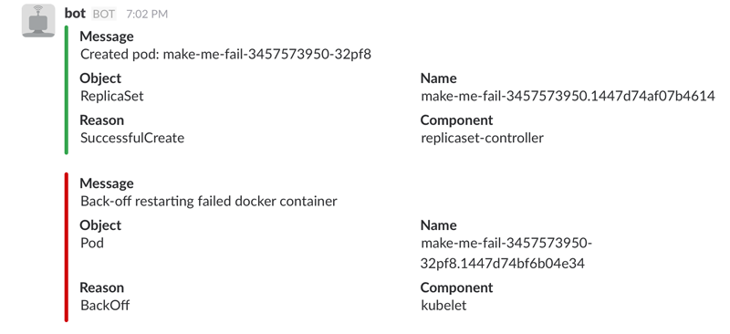

# Kubernetes Events Slack Bot (slack8s)

Infinite loop go program which queries the Kubernetes Event Stream API and
posts messages to slack for important events.

## Building

Given this is an active work in progress, you'll probably want to modify
and build the code yourself. If you just want to get started quickly,
use the image in [docker hub](https://hub.docker.com/r/ultimateboy/slack8s/).

1. `docker build .`
2. Tag and push to your favorite registry

## Running

1. Copy the example configmap file:  
`cp examples/example.slack8s-configmap.yaml examples/slack8s-configmap.yaml`
2. Modify `slack-token` and `slack-channel` variables in your new file.
3. Create the config map using kubectl:  
`kubectl create -f examples/slack8s-configmap.yaml`
4. Create the slack8s replication controller:  
`kubectl create -f examples/slack8s-rc.yaml`

# Todo

1. Refactor the way in which the types of alerts to send to slack are configured
2. Add more types of alerts which get posted to slack
3. Better formatting of slack attachment output
4. Alerting thresholds
